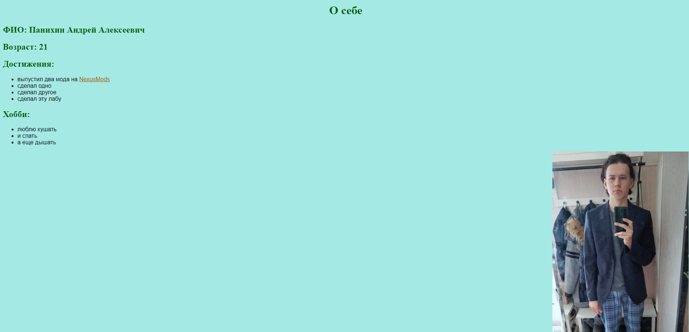

МИНИСТЕРСТВО НАУКИ И ВЫСШЕГО ОБРАЗОВАНИЯ 
РОССИЙСКОЙ ФЕДЕРАЦИИ 
ФЕДЕРАЛЬНОЕ ГОСУДАРСТВЕННОЕ БЮДЖЕТНОЕ 
ОБРАЗОВАТЕЛЬНОЕ УЧРЕЖДЕНИЕ ВЫСШЕГО ОБРАЗОВАНИЯ 
«САХАЛИНСКИЙ ГОСУДАРСТВЕННЫЙ УНИВЕРСИТЕТ»

      

Институт естественных наук и техносферной безопасности Кафедра информатики Панихин Андрей Алексеевич

   

 <strong>Лабораторная работа №1.</strong> 01.03.02 Прикладная математика и информатика

            
   

г. Южно-Сахалинск 2024 г.

      

<h1 align = "center">Введение</h1>
HTML — это язык разметки гипертекстовых документов. Он нужен, чтобы отображать в браузере специальным образом отформатированный документ с множеством вложенных элементов: заголовками, абзацами, списками, гиперссылками, медиаисточниками, расположением изображений, видео и аудио.

<h1 align = "center">Цели и задачи</h1>

- Создать сайт с информацией о себе
- Научиться базовым функциям HTML

<h1 align = "center">Решение</h1>
<h2 align = "center">Файл ЛР1.html</h2>

~~~html
<!DOCTYPE html>
<html lang="en">

<head>
    <meta charset="UTF-8">
    <meta name="viewport" content="width=device-width, initial-scale=1.0">
    <link rel="stylesheet" href="styles.css">
    <title>ЛР1</title>
</head>

<body style="background-color: rgb(165, 233, 229);">
    <h1 style="text-align: center;">О себе</h1>
    <h2>ФИО: Панихин Андрей Алексеевич</h2>
    <h2>Возраст: 21</h2>
    <h2>Достижения:</h2>
    <ul style="font-family: Arial, Helvetica, sans-serif;">
        <li>выпустил два мода на <a href="https://www.nexusmods.com/users/66382856?tab=user+files" target="_blank">NexusMods</a></li>
        <li>сделал одно</li>
        <li>сделал другое</li>
        <li>сделал эту лабу</li>
    </ul>
    <h2>Хобби:</h2>
    <ul style="font-family: Arial, Helvetica, sans-serif;">
        <li>люблю кушать</li>
        <li>и спать</li>
        <li>а еще дышать</li>
    </ul>
    
</body>

</html>
~~~

<h2 align = "center">Файл styles.css</h2>

~~~css
h1 {
    color:darkgreen;
}

h2 {
    color: darkgreen;
}

a:link {
    color: rgb(255, 153, 0);
  }
  
a:visited {
    color: rgb(160, 96, 0);
  }
~~~

<h1 align = "center">Решение</h1>

<h1 align = "center">Вывод</h1>

Научился базовому функционалу HTML создав простой вебсайт.

